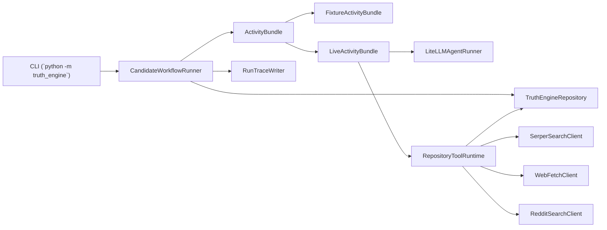

# Architecture

Truth Engine is organized around a small deterministic core and a set of bounded side-effect layers.

## High-Level Runtime

## Execution Modes

| Mode | Entry command | Source of stage outputs | Main purpose |
|---|---|---|
| Fixture | `run-fixture` | JSON fixture scenarios | deterministic workflow verification |
| Live | `run-live` | LLM calls plus repository/network tools | real stage `0-5` execution |

## Layering Rules

| Layer | Purpose | Key files |
|---|---|---|
| Entry | Parse CLI commands and assemble dependencies | `cli/main.py`, `__main__.py` |
| Orchestration | Run the candidate state machine and enforce gates/budgets | `workflows/candidate.py` |
| Activities | Produce stage outputs either from fixtures or live LLM/tool execution | `activities/fixtures.py`, `activities/live.py` |
| Contracts | Shared typed payloads across all layers | `contracts/*.py`, `domain/enums.py` |
| Services | Pure rules and support utilities | `services/*.py` |
| Tools | Agent-visible tool contracts and authorization | `tools/*.py` |
| Adapters | Concrete integrations for DB, LLM, web search/fetch, Reddit, migrations | `adapters/*` |
| Reporting | Final dossier rendering | `reporting/dossier.py` |
| Prompts | Prompt compilation and role text | `prompts/*` |

## Package Reference

### `truth_engine.cli`

- `main.py`: defines `init-db`, `run-fixture`, `run-live`, `export-dossier`, and `preview-prompt`.
- Builds the live tool runtime from settings.
- Creates the trace writer and writes dossier artifacts after successful Gate B runs.

### `truth_engine.workflows`

- `candidate.py`: the core runtime.
- `CandidateWorkflowRunner` drives one candidate from stage 0 through Gate B.
- Owns loop control, budget enforcement, decision persistence, caution flags, and final outcome assembly.

### `truth_engine.activities`

- `base.py`: `ActivityBundle` protocol used by the workflow runner.
- the protocol still uses fixture-shaped result classes as its return types
- `fixtures.py`: deterministic replay bundle backed by JSON fixtures.
- `live.py`: LLM-backed stage execution with prompt compilation, tool schemas, repository-backed tool state, and cached cross-stage context.

### `truth_engine.contracts`

- `models.py`: foundational domain models like `RawArena`, `RawSignal`, `ProblemUnit`, and `CostRecord`.
- `stages.py`: stage outputs, dossiers, and workflow outcomes.
- `decisions.py`: small gate-specific snapshot models.
- `live.py`: live request and founder constraints.
- `fixtures.py`: full typed structure for fixture scenarios.

### `truth_engine.domain`

- `enums.py`: shared enums for agent names, stages, gate actions, budget modes, and tool metadata.

### `truth_engine.services`

- `budgets.py`: candidate-level budget modes and per-stage budget table.
- `dedup.py`: arena fingerprinting and canonical URL hashing.
- `gates.py`: Gate A, wedge, and Gate B decisions.
- `learnings.py`: retrospective learnings extracted from killed/passed candidates.
- `logging.py`: terminal-friendly structured logs.
- `run_trace.py`: append-only Markdown trace writer for live and fixture runs.

### `truth_engine.tools`

- `specs.py`: `ToolSpec` dataclass.
- `registry.py`: canonical tool list.
- `bundles.py`: per-agent allowed tool sets.
- `schemas.py`: LLM function-call JSON schemas generated from contracts.
- `runtime.py`: execution and authorization layer for repository and live adapter tools.

### `truth_engine.adapters`

- `db/schema.py`: SQLAlchemy table definitions.
- `db/repositories.py`: repository API for candidate state, evidence, stage runs, costs, decisions, dossier payloads, and learnings.
- `db/migrate.py`: Alembic upgrade entrypoint.
- `llm/litellm_runner.py`: LLM execution loop with tool calls, JSON repair, duplicate-call blocking, and trace capture.
- `search/serper.py`: Serper client with retry + structured error return.
- `scraping/web.py`: `httpx` fetch and `trafilatura` extraction with retry.
- `reddit/praw_client.py`: Reddit search/fetch via PRAW.

### `truth_engine.prompts`

- `builder.py`: compiles a `PromptBundle` from shared invariants, agent role text, allowed tools, output contract, and normalized runtime context.
- `shared/*.md`: evidence, output, tool, and invariant policies.
- `agents/*/role.md`: role instructions for the implemented stage agents.

### `truth_engine.reporting`

- `dossier.py`: renders a Gate B dossier to Markdown and writes both Markdown and JSON artifacts.

## Key Interactions

### Fixture mode

1. CLI loads a fixture JSON file.
2. `FixtureActivityBundle` returns pre-authored stage outputs in sequence.
3. `CandidateWorkflowRunner` persists them exactly as if they came from live execution.
4. Integration tests validate loop behavior and repository state.

### Live mode

1. CLI builds repository, tool runtime, LLM runner, and a `LiveRunRequest`.
2. `LiveActivityBundle` compiles a prompt for each stage.
3. Tool-backed agents call repository and network tools through `RepositoryToolRuntime`.
4. The workflow runner persists every stage run and cost record, then applies gates.

## State Ownership

The codebase is easier to understand if you keep these ownership boundaries in mind:

- `CandidateWorkflowRunner` owns control flow, retries, gate decisions, and candidate-level state transitions.
- `LiveActivityBundle` owns prompt construction, live cross-stage context, and which response model each agent must produce.
- `LiteLLMAgentRunner` owns tool-calling semantics and JSON repair.
- `TruthEngineRepository` owns durable state, not business decisions.
- `RepositoryToolRuntime` is the only place tool-backed agents are allowed to persist findings.

## Architectural Reality Check

These points matter because older planning docs describe a broader or slightly different system:

- The orchestrator is a plain Python runner, not a Temporal workflow.
- The database layer is SQLAlchemy Core plus Alembic, not an ORM-heavy design.
- SQLite is used heavily in tests and local flows even though PostgreSQL is the intended production store.
- Prompt compilation is implemented with Pydantic and Markdown role files; there is no Instructor integration in the current code.
- Web extraction uses `httpx` + `trafilatura`; Scrapling is not currently wired.
- `Settings.temporal_host` and the Temporal docker service exist as forward-looking scaffolding only.
