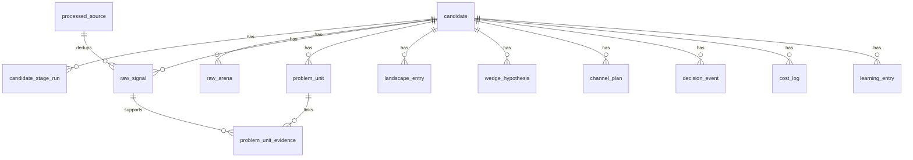

# Data Model

Truth Engine uses Pydantic models for runtime contracts and SQLAlchemy Core tables for persistence.

## Core Runtime Models

| Model | Purpose |
|---|---|
| `RawArena` | stage-0 arena proposal with market signals and ICP data |
| `RawSignal` | raw evidence item from search, Reddit, job posts, or the public web |
| `ProblemUnit` | normalized pain cluster used for scoring |
| `LandscapeEntry` | competitor, failed attempt, open-source tool, or adjacent solution |
| `ScoredCandidate` | scored `ProblemUnit` plus dimension evidence/rationale |
| `SkepticReport` | adversarial review of the top-scored candidate |
| `WedgeHypothesis` | a concrete solution wedge |
| `ChannelValidation` | reachability and buyer/channel plan for Gate B |
| `CandidateDossier` | final Gate B artifact assembled from the best candidate state |
| `WorkflowOutcome` | final status and decision event for the whole run |

## Decision Models

Small gate inputs live in `contracts/decisions.py`:

- `CandidateScoreSnapshot`
- `SkepticSnapshot`
- `WedgeSnapshot`
- `ChannelValidationSnapshot`
- `GateDecision`

These are intentionally narrow so gate logic stays simple and testable.

## Important Model Behaviors

### Arena dedup

`RawArena.fingerprint()` uses:
- normalized `domain`
- normalized `icp_user_role`

The normalization collapses case, punctuation, and whitespace.

### Source dedup

`RawSignal` auto-derives `source_url_hash` when absent.

URL canonicalization:
- normalizes scheme/host casing
- removes default ports
- strips trailing slash noise
- drops tracking query params like `utm_*`, `gclid`, `fbclid`, and `ref`
- ignores fragments

## Database Tables

The current schema contains 13 tables.

Important schema reality:
- relations are enforced in application code; the migration does not define database-level foreign keys
- most domain payloads are stored as JSON blobs alongside a small number of indexed columns
- `processed_source` is global, so URL dedup applies across candidates, not just within one run

### Candidate state

| Table | What it stores |
|---|---|
| `candidate` | current candidate status, selected arena/problem/wedge IDs, total cost, optional dossier payload |
| `candidate_stage_run` | every stage execution payload, prompt version/hash, model alias, token counts, tool calls, cost |
| `decision_event` | Gate A, wedge-path, Gate B, and safety-cap decisions |
| `cost_log` | normalized per-stage cost records |
| `learning_entry` | retrospective learnings extracted after pass/kill |

### Evidence and market state

| Table | What it stores |
|---|---|
| `raw_arena` | persisted arena proposals plus fingerprint and status |
| `processed_source` | global URL-hash dedup ledger |
| `raw_signal` | persisted evidence items |
| `problem_unit` | normalized problem clusters |
| `problem_unit_evidence` | links between problem units and raw signals |
| `landscape_entry` | persisted landscape findings |
| `wedge_hypothesis` | all generated wedges, including selection flag |
| `channel_plan` | channel plans by Gate B attempt index |

## Candidate Lifecycle in Storage

1. Candidate row is created with status `running`.
2. Arena proposals are stored in `raw_arena`.
3. Signal URLs are deduped through `processed_source`, then signals go to `raw_signal`.
4. Normalization overwrites `problem_unit` and `problem_unit_evidence`.
5. Landscape research overwrites or appends `landscape_entry` depending on execution mode.
6. Wedge selection writes all wedges and marks one selected.
7. Gate decisions append `decision_event`.
8. Stage runs append `candidate_stage_run` and `cost_log`, then increment `candidate.total_cost_eur`.
9. Successful Gate B runs store `dossier_payload` on `candidate`.

## Reserved and Partially-Used Fields

Some fields exist in the contracts or schema but are not fully exploited yet:

- `candidate.caution_flag` exists in storage, but the workflow mainly carries caution as dossier-level `caution_flags`
- `CandidateDossier.cost_breakdown` and `CandidateDossier.total_cost_eur` exist in the schema, but the current dossier builder does not populate them
- `raw_arena.status` is actively used for `proposed`, `selected`, `transferred`, and `killed`, but there is no broader arena lifecycle table yet

## Migration State

The repository contains one Alembic migration:
- `migrations/versions/20260310_0001_initial_schema.py`

It creates the full v0.1 schema used by the current runner.
