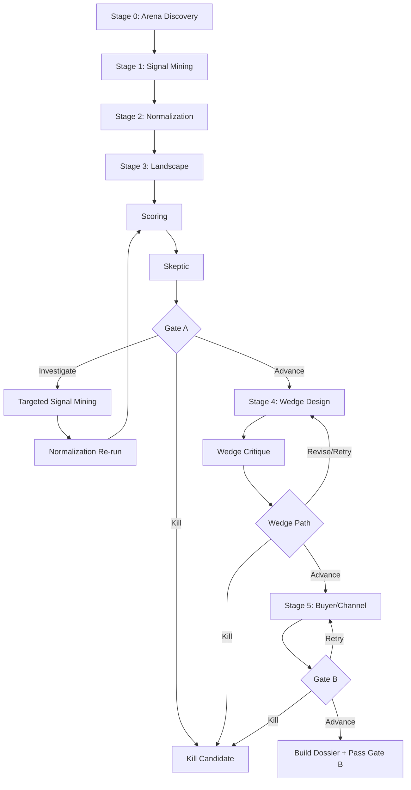

# Workflow

The implemented runtime executes a single candidate through stages `0-5` and stops at Gate B.

## End-to-End Flow

## Stage Summary

| Stage | Agent(s) | Live-stage inputs | Persisted output |
|---|---|---|---|
| Arena discovery | `arena_scout`, `arena_evaluator` | founder constraints, recent learnings | raw arena proposals, stage runs, cost logs |
| Signal mining | `signal_scout` | selected arena, source targets, optional skeptic weakness | raw signals, processed source hashes, stage runs, cost logs |
| Normalization | `normalizer` | selected arena, current raw signals | problem units + evidence links |
| Landscape/scoring/skeptic | `landscape_scout`, `scorer`, `skeptic` | selected arena, problem units, evidence, landscape entries | landscape entries, stage runs, decision events |
| Wedge design | `wedge_designer`, `wedge_critic` | top scored candidate, problem unit, skeptic report | wedges, decision events |
| Buyer/channel | `buyer_channel_validator` | selected wedge, top candidate, problem unit | channel plans, final Gate B decision, dossier |

## Gate A

Gate A is computed from:
- `ScoredCandidate.total_score`
- `SkepticReport.recommendation`
- investigation iteration count
- current budget mode

Decision rules implemented in `services/gates.py`:

- Score `>= 70` -> advance
- Score `< 40` -> kill
- Score `40-69` + skeptic `kill` + score `< 60` -> kill
- Score `40-69` + skeptic `investigate` + loop budget left -> targeted evidence pass
- Score `40-69` + skeptic `advance` + score `>= 50` -> advance with caution
- Investigation exhausted:
  - score `>= 60` -> advance with caution
  - otherwise -> kill

## Wedge Loop

The wedge loop uses `wedge_verdict_for_critique(...)` to inspect the best wedge:

- `strong` or `viable` -> advance
- `needs_work` with loop budget left -> revise
- `weak` with loop budget left -> redesign
- exhausted -> kill

When the workflow advances, the chosen wedge is persisted and marked selected.

## Gate B

Gate B checks:
- `verdict == reachable`
- `total_reachable_leads >= 50`
- at least `2` channels
- non-empty `user_role` and `buyer_role`
- `estimated_cost_per_conversation <= 5.0`

If the validator returns `marginal`, the runner allows one retry in normal budget mode and zero retries in degrade mode.

## Budget Behavior

Candidate budget mode is global:

| Mode | Threshold | Effect |
|---|---|---|
| `normal` | `<= EUR 5.00` | full loop/retry behavior |
| `degrade` | `EUR 5.01 - 7.00` | optional loops and Gate B retry suppressed |
| `safety_cap` | `> EUR 7.00` | current stage persistence finishes, then candidate is killed |

Important runtime detail:
- Budget enforcement happens after each recorded stage run, not before every individual tool call.
- If a stage pushes the candidate above `EUR 7`, the runner raises `BudgetSafetyCapExceeded` and records a kill decision.
- Optional loop budgets are:
  - Gate A investigation: `2` in `normal`, `0` in `degrade`
  - wedge revise/retry loop: `2` in `normal`, `0` in `degrade`
  - Gate B retry: `1` in `normal`, `0` in `degrade`

## Fixture vs Live Behavior

### Fixture mode

- Tool-backed persistence is replayed by the workflow runner.
- The fixture bundle itself does not persist state.
- This makes fixtures deterministic and suitable for integration tests.

### Live mode

- Tool-backed agents persist arenas, signals, and landscape entries as they work.
- The workflow runner only persists non-tool outputs plus stage/cost records.
- Live activities also carry stage-local memory such as selected arena, latest scoring result, and latest wedge proposal.

## Final Outcome

A successful run:
- stores a `CandidateDossier` on the candidate record
- writes `./out/<candidate_id>.json`
- writes `./out/<candidate_id>.md`
- writes `./out/<candidate_id>.trace.md`
- stores pass learnings

A killed run:
- marks the candidate and selected arena as killed
- stores decision history and costs
- does not produce a dossier

Current nuance:
- kill learnings are only extracted on the Gate A kill branch
- wedge-path kills, Gate B kills, and safety-cap kills do not currently persist learnings
