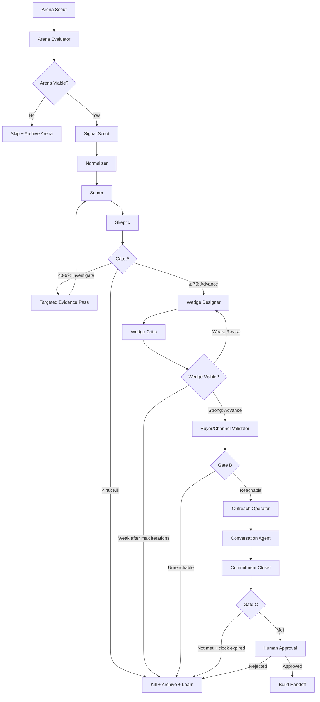

# Truth Engine V1 — In-Depth Agent Workflow

Purpose: definitive operational spec. Every stage, agent, schema, gate, feedback loop, and cross-cutting system fully defined. This document is the source of truth for building V1.

---

## Principles

1. **Autonomous-first.** Human enters only at commitment negotiation and final Gate C approval.
2. **Evidence-backed.** Every claim that affects a decision must cite evidence. No vibes.
3. **Kill fast.** Most candidates should die early and cheap. Only proven survivors get expensive stages.
4. **Feedback loops are bounded.** Every iterative refinement cycle has a hard maximum (1-2 iterations). No zombies.
5. **Learn from everything.** Every completed candidate (killed or passed) generates structured learnings for future runs.

---

## System Flow



---

## Stage 0: Arena Discovery

### Purpose

Find promising arenas worth exploring. An arena is a bounded search space — not a business idea, but the territory where ideas live.

### Agents

**Arena Scout** | Tier 1 | **Tool-based agent**

The Scout's job is divergent: cast a wide net and propose raw arena candidates based on market signals. It uses tools to manage its proposals incrementally, getting real-time dedup feedback during search.

**What it searches for:**

| Signal Type | Source | What It Indicates |
|---|---|---|
| Job posting volume/growth | Indeed, LinkedIn | Companies hiring for a role = pain exists at scale |
| Funding announcements | Crunchbase, TechCrunch, X | Money flowing into a space = market validation |
| G2/Capterra category growth | G2, Capterra | Software category growing = demand increasing |
| Reddit community activity | Reddit (PRAW) | Active complaints = visible pain |
| Regulatory/compliance changes | Gov sites, industry news | Forced spending = urgency + deadlines |
| Emerging tool categories | ProductHunt, HackerNews | New capabilities creating new opportunities |
| "Alternative to X" searches | Google Trends, forums | Switching intent = dissatisfaction with incumbents |

**Input (system context, available throughout the search):**
```
founder_constraints:
  solution_modalities: list[str]        # ["saas", "api", "tool", "browser_extension", "automation", "integration"]
  excluded_business_models: list[str]   # ["physical_operations", "manual_service_delivery", "brick_and_mortar_ownership"]
  target_market: str                    # "any" — customer can be in any industry
  geo_preference: str                   # "EU + US"
  v1_filter: str                        # "software_first" (hardware/robotics = V2)
past_learnings: list[LearningEntry]     # relevant learnings from prior runs
```

Note: `excluded_business_models` constrains what YOU operate, NOT who you sell to. "Restaurant supply chain SaaS" is valid (solution = software). "Open a restaurant" is not (business model = physical operations).

**Tools (available to the agent during search):**

| Tool | What It Does | Returns |
|---|---|---|
| `create_arena_proposal(arena_data)` | Saves a new RawArena. Triggers similarity check against killed arena embeddings. Max 8 proposals. | Success + dedup feedback: "No similar killed arenas" or "78% similar to killed arena [X], killed because [reason]. Saved but flagged." or "92% similar to [X] — blocked, not saved. Try a different angle." |
| `edit_arena_proposal(id, changes)` | Updates an existing proposal with new info | Updated proposal summary |
| `remove_arena_proposal(id)` | Removes a proposal the agent no longer thinks is strong | Confirmation |
| `view_arena_proposals()` | Returns brief summaries of all current proposals | List of `{id, domain, icp_user_role, rationale}` (compact, not full objects) |

**Similarity thresholds on `create`:**
- `> 0.85` → blocked. Not saved. Agent told why the similar arena was killed.
- `0.70-0.85` → saved but flagged. Agent told about the similar arena and its kill reason. Agent decides to keep, edit, or remove.
- `< 0.70` → saved normally.

**Final output (after search is complete):**
```
ArenaSearchResult:
  sources_searched: list[str]
  search_summary: str
  # arenas are already stored via create_arena_proposal tool calls
```

**RawArena schema (used in `create_arena_proposal`):**
```
RawArena:
  domain: str                     # "logistics operations", "restaurant supply chain"
  icp_user_role: str              # "warehouse operations manager", "restaurant owner"
  icp_buyer_role: str             # "VP of Operations", "restaurant owner" (can be same as user)
  geo: str                        # "EU + US"
  channel_surface: list[str]      # ["linkedin", "industry_forums", "g2_reviews"]
  solution_modality: str          # "saas", "api", "tool" (must match founder_constraints)
  market_signals: list[str]       # evidence snippets that suggest this arena is promising
  signal_sources: list[str]       # URLs of the evidence
  market_size_signal: str         # "500+ job postings, 3 funded competitors, growing G2 category"
  expected_sales_cycle: str       # "2-4 weeks"
  rationale: str                  # 2-3 sentences: why this arena looks promising
```

**Agent workflow:**
1. Search a source (e.g., job posting trends)
2. Spot a promising arena → `create_arena_proposal(...)` → get dedup feedback
3. If flagged as similar to killed arena → decide to keep, refine, or remove
4. Continue searching other sources
5. Find more info about an earlier proposal → `edit_arena_proposal(id, ...)`
6. Optionally `view_arena_proposals()` to see what's been found so far
7. When satisfied (or max 8 proposals reached) → return search summary

---

**Arena Evaluator** | Tier 2

The Evaluator's job is convergent: score each raw arena, rank them, and determine viability.

**Scoring dimensions:**

| Dimension | Weight | What It Measures |
|---|---|---|
| Pain signal visibility | 20% | How easy is it to find visible pain in this arena from public sources? (directional — exhaustive mining happens in Stage 1) |
| Market size signal | 25% | Is there a large enough addressable market? |
| ICP reachability | 20% | Can we realistically contact these people online? |
| Spend indicators | 10% | Are there directional indicators of spend? (funded competitors, paid tool categories, hiring signals — deep validation happens in Stage 1+3) |
| Competition landscape | 10% | Is there room for a new entrant, or is it winner-take-all? |
| Founder constraint fit | 15% | Does this match the founder's modality and domain preferences? |

**Input:**
```
raw_arenas: list[RawArena]       # from Arena Scout
founder_constraints: dict         # same as Scout input
```

**Output:**
```
ArenaEvaluation:
  ranked_arenas: list[EvaluatedArena]
  evaluation_summary: str

EvaluatedArena:
  arena: RawArena                 # original proposal
  score: int                      # 0-100
  dimension_scores: dict[str, int]
  dimension_rationale: dict[str, str]  # per-dimension reasoning with evidence
  viability_verdict: str          # "viable", "marginal", "not_viable"
  risks: list[str]                # key risks identified
  recommended_first_sources: list[str]  # where Signal Scout should start mining
```

### Arena Viability Gate

| Rule | Action |
|---|---|
| Top arena scores ≥ 60 and verdict = "viable" | Create candidate, advance to Stage 1 |
| Top arena 40-59 or verdict = "marginal" | Create candidate with caution flag, advance |
| All arenas < 40 or all "not_viable" | Expand search with different source mix, one retry. If still nothing → pause, flag for human review |

**After gate pass:** The top-ranked viable arena becomes the active arena. A candidate is created within it. System advances to Stage 1.

**Budget:** €0.15 combined (Scout + Evaluator). Amortized across candidates if arena produces multiple candidates.

---

## Stage 1: Signal Mining

### Purpose

Mine raw pain, spend, and behavior signals from the arena's target sources. Output is raw, unstructured evidence — volume over precision.

### Agent

**Signal Scout** | Tier 1 | **Tool-based agent**

**What it does:**
1. Takes the arena + recommended sources from the Evaluator
2. For each source type, runs targeted searches/scrapes
3. Extracts structured signals from raw content using LLM
4. Uses `add_signal` tool to save each signal — tool checks URL dedup and auto-assigns reliability cap
5. Tags signals per source type

**Source reliability caps (auto-applied by `add_signal` tool):**

| Source | Reliability Cap | Rationale |
|---|---|---|
| Reddit posts/comments | 0.40 | Selection bias, demographic skew |
| G2/Capterra reviews | 0.40 | Self-selected reviewers, sometimes incentivized |
| Job postings | 0.50 | Direct signal of org spending and pain |
| GitHub issues | 0.30 | Developer-biased, narrow population |
| Forum posts | 0.40 | Varies by community quality |
| YouTube comments | 0.30 | Low signal-to-noise |
| App store reviews | 0.40 | Consumer-biased but honest |
| News/funding announcements | 0.45 | Market-level signal, not individual pain |

**V1 priority sources:** Pick the 3 highest-signal, easiest-to-access sources per arena. Don't try to scrape everything. Likely first picks: Reddit + G2/Capterra + job postings.

**Input (system context):**
```
arena: EvaluatedArena
source_targets: list[str]         # from Evaluator's recommended_first_sources
max_signals: int                  # 200 (cap for cost control)
```

**Tools (available to the agent during mining):**

| Tool | What It Does | Returns |
|---|---|---|
| `add_signal(signal_data)` | Saves a RawSignal. Checks URL hash against dedup table — rejects already-processed sources. Auto-caps reliability score by source type. | Success + signal count so far, or "Duplicate — already processed" |
| `view_signal_summary()` | Returns current signal count, breakdown by source type, top pain themes emerging | Compact summary (not full signal list) |

The tool-based approach means the agent doesn't carry 200 signals in its context. It processes sources one at a time, saves signals as it goes, and can check `view_signal_summary()` to see if it has enough coverage or should keep searching.

**Final output (after mining is complete):**
```
SignalMiningResult:
  sources_searched: int
  sources_skipped_dedup: int
  search_summary: str
  # signals are already stored via add_signal tool calls
```

**RawSignal schema (used in `add_signal`):**
```
RawSignal:
  source_type: str                # reddit, g2_review, job_post, github_issue, forum, youtube, app_review
  source_url: str
  source_url_hash: str            # for dedup table (auto-computed by tool if not provided)
  verbatim_quote: str             # exact text from source
  persona: str | null             # inferred role/title of the person
  inferred_pain: str              # one-line pain description
  inferred_frequency: str         # daily, weekly, monthly, event-driven, unknown
  proof_of_spend: bool            # does this signal indicate money is already being spent?
  switching_signal: bool          # does this signal indicate desire/intent to switch tools?
  tags: list[str]                 # for clustering
  reliability_score: float        # auto-capped per source type by tool
  extracted_at: datetime
```

**Agent workflow:**
1. Pick a source from `source_targets`
2. Search/scrape it
3. For each relevant finding → `add_signal(...)` → get dedup feedback + running count
4. Periodically `view_signal_summary()` to check coverage and gaps
5. Move to next source
6. Stop when: max_signals reached, source_targets exhausted, or coverage looks sufficient
7. Return search summary

**Budget:** €0.30

---

## Stage 2: Normalization

### Purpose

Cluster raw signals into coherent ProblemUnits. Transform messy real-world data into structured, comparable units the Scorer can evaluate.

### Agent

**Normalizer** | Tier 1

**What it does:**
1. Groups raw signals by inferred job-to-be-done (semantic clustering)
2. For each cluster, synthesizes a ProblemUnit with all required fields
3. Links evidence (RawSignal IDs) to each ProblemUnit
4. Assigns confidence based on signal count and source diversity

**Clustering rules:**
- Signals describing the **same underlying job-to-be-done** from the **same ICP role type** merge into one ProblemUnit
- Different JTBD = different ProblemUnit, even if same ICP
- Same JTBD but fundamentally different ICP = different ProblemUnit
- If a signal doesn't clearly fit any cluster → standalone ProblemUnit (singletons are valid but will score low on signal_count)

**Input:**
```
raw_signals: list[RawSignal]
arena: EvaluatedArena
```

**Output:**
```
NormalizationResult:
  problem_units: list[ProblemUnit]   # target: 5-20 from 50-200 raw signals
  unclustered_signals: int           # signals that didn't fit any group
  clustering_summary: str

ProblemUnit:
  id: str
  job_to_be_done: str                # what the ICP is trying to accomplish
  trigger_event: str                 # when/why the pain occurs
  frequency: str                     # daily, weekly, monthly, event-driven
  severity: int                      # 1-10
  urgency: str                       # is there a deadline or forcing function?
  cost_of_failure: str               # what happens if the problem isn't solved
  current_workaround: str            # how they solve it today (tools, manual steps, hires)
  proof_of_spend: str                # evidence of money already being spent
  switching_friction: int            # 1-10, how hard is it to change current behavior
  buyer_authority: str               # who owns budget for this problem
  evidence_ids: list[str]            # linked RawSignal IDs
  signal_count: int                  # number of raw signals in this cluster
  source_diversity: int              # number of distinct source types represented
  confidence: float                  # 0.0-1.0, based on signal count + diversity
```

**Confidence heuristic:**
- 1 signal, 1 source type → 0.15
- 3-5 signals, 1-2 source types → 0.30
- 5-10 signals, 2-3 source types → 0.45
- 10+ signals, 3+ source types → 0.50 (cap for scraped data)

**Budget:** €0.15

---

## Stage 3: Scoring + Skeptic

### Purpose

Evaluate ProblemUnit quality. Score brutally, challenge assumptions, and optionally investigate weaknesses. The feedback loop ensures borderline candidates get a fair shot without becoming zombies.

### Agents

**Scorer** | Tier 2

Scores each ProblemUnit on a weighted rubric with anchored examples. Picks the top candidate.

**Scoring rubric:**

| Dimension | Max Points | Weight | Anchors |
|---|---|---|---|
| Pain severity | 15 | 15% | 3: "mild annoyance, people mention it occasionally" / 7: "significant frustration, multiple complaints with emotional language" / 10: "business-critical, failure = revenue loss or compliance violation" |
| Pain frequency | 10 | 10% | 3: "quarterly/rare" / 6: "weekly" / 10: "daily or continuous" |
| Urgency | 10 | 10% | 3: "no deadline, whenever they get to it" / 7: "seasonal deadline or budget cycle" / 10: "regulatory deadline, contractual obligation, imminent cost" |
| Proof of spend | 20 | 20% | 5: "no evidence of spending" / 10: "they mention using free tools or manual workarounds" / 15: "they mention paid tools or hired roles" / 20: "multiple signals of established budget lines" |
| Reachability | 15 | 15% | 5: "ICP exists but no clear online channel" / 10: "active on 1-2 platforms" / 15: "highly active on multiple accessible platforms" |
| Buyer authority clarity | 10 | 10% | 3: "unclear who decides" / 7: "buyer role identifiable" / 10: "buyer role + budget signals clear" |
| Founder advantage | 10 | 10% | 3: "no special access or knowledge" / 7: "relevant domain interest" / 10: "direct expertise or network in this space" |
| Switching friction | -7 | penalty | -2: "low friction, easy to adopt" / -5: "moderate, requires workflow change" / -7: "high, deep integration with existing tools, org-wide change needed" |
| Crowdedness | -3 | penalty | -1: "few competitors, open space" / -2: "several competitors but differentiable" / -3: "saturated, competitors look identical" |

**Max possible score: 90** (all positives maxed, no penalties). **Auto-kill threshold: < 40.**

**Input:**
```
problem_units: list[ProblemUnit]
arena: EvaluatedArena
past_learnings: list[LearningEntry]   # relevant scoring learnings
```

**Output:**
```
ScoringResult:
  scored_candidates: list[ScoredCandidate]  # all ProblemUnits scored, ranked
  top_candidate: ScoredCandidate
  scoring_summary: str

ScoredCandidate:
  problem_unit_id: str
  total_score: int                         # 0-90
  confidence: float                        # 0.0-1.0
  confidence_rationale: str
  dimension_scores: dict[str, int]         # per-dimension score
  dimension_evidence: dict[str, str]       # per-dimension evidence citation
  dimension_rationale: dict[str, str]      # per-dimension reasoning
  weakest_dimensions: list[str]            # bottom 2-3 dimensions (for Skeptic)
```

---

**Skeptic** | Tier 3

Challenges the top candidate. Looks for inflated scores, missing evidence, overlooked risks, and prior failures.

**What it specifically checks:**
1. **Evidence integrity:** Are the cited sources real and do they actually support the claimed score? (catches LLM hallucination)
2. **Severity inflation:** Is the pain as severe as scored, or is it just vocal minorities?
3. **Proof-of-spend reality:** Do the "proof of spend" signals actually indicate budget, or just free-tool usage?
4. **Switching friction undercount:** Is switching harder than estimated? Are there integrations, compliance, or org-change barriers?
5. **Prior attempts:** Has someone tried to solve this before? What happened? Why did they fail?
6. **Selection bias:** Are the signals representative, or do they come from a narrow demographic?

**Input:**
```
top_candidate: ScoredCandidate
problem_unit: ProblemUnit
evidence_items: list[RawSignal]    # the actual evidence behind this candidate
arena: EvaluatedArena
```

**Output:**
```
SkepticReport:
  candidate_id: str
  evidence_integrity: str          # "solid", "some_gaps", "suspicious"
  risk_flags: list[str]            # specific weaknesses found
  missing_evidence: list[str]      # what evidence would strengthen or weaken the case
  disconfirming_signals: list[str] # evidence that contradicts the hypothesis
  prior_attempts: list[str]        # known companies/products that tried this
  inflated_dimensions: list[str]   # dimensions where score seems too high
  primary_weakness: str            # the single biggest gap (used for targeted evidence pass)
  overall_risk: str                # low, medium, high
  recommendation: str              # advance, investigate, kill
  recommendation_rationale: str
```

### Feedback Loop: Targeted Investigation

When the score is in the investigation zone (40-69), a bounded feedback loop runs to give the candidate a fair chance.

**Loop mechanics:**

```
max_iterations = 2
iteration = 0

SCORE candidate
CRITIQUE candidate

while True:
    if score >= 70:
        → ADVANCE to Stage 4 (Skeptic report attached as advisory)
        break
    
    if score < 40:
        → AUTO-KILL
        break
    
    if score 40-69:
        if skeptic.recommendation == "kill" and score < 60:
            → AUTO-KILL
            break
        
        if skeptic.recommendation == "investigate" and iteration < max_iterations:
            weakness = skeptic.primary_weakness
            → Run TARGETED EVIDENCE PASS:
                1. Signal Scout re-runs with a focused query targeting the weakness
                   (e.g., weakness = "no proof of spend" → search for "[ICP role] budget",
                    "[tool category] pricing", job postings with salary/tool budget signals)
                2. Normalizer integrates new signals into the existing ProblemUnit
                3. Scorer re-scores with enriched ProblemUnit
                4. Skeptic re-critiques
            iteration += 1
            continue
        
        if skeptic.recommendation == "advance" and score >= 50:
            → ADVANCE to Stage 4 (with caution flag)
            break
        
        if iteration >= max_iterations:
            if score >= 60:
                → ADVANCE to Stage 4 (with caution flag, investigation exhausted)
                break
            else:
                → AUTO-KILL (exhausted investigation budget, still weak)
                break
```

**Targeted Evidence Pass budget:** €0.15 per iteration (Scout + Normalizer re-run). Max 2 iterations = max €0.30 extra.

### Gate A Summary

| Condition | Action |
|---|---|
| Score < 40 | Auto-kill |
| Score 40-59, Skeptic says "kill" | Auto-kill |
| Score 40-69, Skeptic says "investigate" | Targeted evidence pass, rescore (max 2x) |
| Score 40-69 after max iterations, score ≥ 60 | Advance with caution flag |
| Score 40-69 after max iterations, score < 60 | Auto-kill |
| Score 40-69, Skeptic says "advance", score ≥ 50 | Advance with caution flag |
| Score ≥ 70 | Advance |

**Budget for Stage 3 (total):** €0.30 base + €0.30 max investigation = €0.60 worst case

---

## Stage 4: Wedge Design

### Purpose

Transform a validated pain signal into a concrete solution hypothesis. The output is a **wedge** — a single, sharp, deliverable promise that solves the core pain and opens a customer relationship.

This stage was missing from the previous workflow. Without it, you'd be reaching out to people saying "you have this problem, right?" instead of "here's how we solve it."

### Agents

**Wedge Designer** | Tier 2

Proposes 2-3 wedge hypotheses based on the validated ProblemUnit.

**What it considers:**
- The specific JTBD and trigger event
- The current workaround (what would we replace?)
- Switching friction (how to minimize it?)
- Solution modality from the arena (SaaS, API, tool, etc.)
- The Hormozi value equation: Value = (Dream Outcome × Perceived Likelihood) / (Time Delay × Effort)
- **Minimum viable wedge**: what's the smallest thing that delivers the core promise?

**Input:**
```
scored_candidate: ScoredCandidate
problem_unit: ProblemUnit
skeptic_report: SkepticReport
arena: EvaluatedArena
past_learnings: list[LearningEntry]
```

**Output:**
```
WedgeProposal:
  wedges: list[WedgeHypothesis]   # 2-3 proposals, ranked
  design_rationale: str

WedgeHypothesis:
  wedge_promise: str              # one sentence: "We [verb] your [pain] so you get [outcome]"
  solution_type: str              # saas, api, tool, extension, automation, integration
  key_capability: str             # what does it actually do (1-2 sentences)
  target_outcome: str             # measurable result for the customer
  differentiation: str            # why this is better than current workaround AND competitors
  rough_pricing: str              # pricing model + anchor (e.g., "€99/mo per user, usage-based")
  delivery_complexity: str        # low, medium, high — how hard is this to build?
  mvp_scope: str                  # what the absolute minimum V1 would include
  first_10_onboarding: str        # how first customers get started
  switching_ease: str             # how you minimize adoption friction
  data_advantage: str             # what unique data position this creates over time
```

---

**Wedge Critic** | Tier 3

Challenges each proposed wedge. Tests feasibility, differentiation, and alignment with actual pain.

**What it specifically checks:**
1. **Promise vs evidence alignment:** Does the wedge actually address the JTBD from the ProblemUnit, or is it a tangential solution?
2. **Technical feasibility:** Can this realistically be built as an MVP by a small team?
3. **Differentiation strength:** Would a customer choose this over continuing with their current workaround? Why?
4. **Pricing viability:** Is the pricing model realistic for the ICP's budget and purchasing behavior?
5. **Switching barrier analysis:** Does the wedge minimize switching friction, or does it require painful migration?
6. **Competitive response:** If this works, how would incumbents respond? Is the wedge defensible?

**Input:**
```
wedge_proposal: WedgeProposal
problem_unit: ProblemUnit
scored_candidate: ScoredCandidate
```

**Output:**
```
WedgeCritique:
  evaluations: list[WedgeEvaluation]
  best_wedge_index: int
  revision_suggestions: list[str]  # specific improvements for the Designer's next iteration
  overall_summary: str

WedgeEvaluation:
  wedge_index: int
  promise_alignment: str           # strong, partial, weak
  feasibility: str                 # feasible, challenging, infeasible
  differentiation_strength: str    # strong, moderate, weak
  pricing_viability: str           # viable, uncertain, unrealistic
  switching_ease: str              # easy, moderate, hard
  competitive_risk: str            # low, medium, high
  verdict: str                     # strong, viable, needs_work, weak
  key_issues: list[str]
```

### Feedback Loop: Wedge Refinement

```
max_iterations = 2
iteration = 0

DESIGN wedges
CRITIQUE wedges

while True:
    best_verdict = critique.evaluations[critique.best_wedge_index].verdict
    
    if best_verdict in ("strong", "viable"):
        → SELECT best wedge, ADVANCE to Stage 5
        break
    
    if best_verdict == "needs_work" and iteration < max_iterations:
        → Wedge Designer revises using critique.revision_suggestions
        → Wedge Critic re-evaluates
        iteration += 1
        continue
    
    if best_verdict == "weak" and iteration < max_iterations:
        → Wedge Designer proposes entirely new wedges using critique.key_issues as constraints
        → Wedge Critic re-evaluates
        iteration += 1
        continue
    
    if iteration >= max_iterations and best_verdict in ("needs_work", "weak"):
        → KILL candidate (no viable wedge found for this pain)
        break
```

**Budget for Stage 4:** €0.20 base + €0.20 max iterations = €0.40 worst case

---

## Stage 5: Buyer/Channel Validation

### Purpose

Now that we have a specific wedge, validate: can we actually reach the ICP to pitch **this** solution? Who buys? Through what channels?

This stage is deliberately placed AFTER wedge design because channel strategy depends on what you're offering. "Can we reach ops managers?" is a different question from "Can we reach ops managers to pitch a logistics automation SaaS?"

### Agent

**Buyer/Channel Validator** | Tier 2

**What it does:**
1. Maps user → buyer → blocker roles for this specific wedge
2. Evaluates 2-3 channel hypotheses for reaching the buyer
3. Estimates lead volume and cost per conversation per channel
4. Generates a concrete lead sourcing strategy

**Input:**
```
selected_wedge: WedgeHypothesis
problem_unit: ProblemUnit
arena: EvaluatedArena
scored_candidate: ScoredCandidate
```

**Output:**
```
ChannelValidation:
  candidate_id: str
  user_role: str
  buyer_role: str
  buyer_is_user: bool              # same person?
  blocker_roles: list[str]         # who might block adoption
  procurement_notes: str           # relevant buying process info
  channels: list[ChannelPlan]      # 2-3 channel plans
  total_reachable_leads: int       # estimated across all channels
  estimated_cost_per_conversation: float
  verdict: str                     # reachable, marginal, unreachable
  verdict_rationale: str

ChannelPlan:
  channel: str                     # email, linkedin, reddit, x, forum, community
  how_to_reach: str                # specific method (e.g., "cold email to Head of Ops via Apollo lead list")
  lead_source: str                 # where to find leads for this channel
  expected_response_rate: float    # estimated
  volume_estimate: int             # how many leads available
  message_angle: str               # how the wedge pitch maps to this channel
  first_20_plan: str               # concrete plan for first 20 conversations
```

### Gate B: Reachability Check

| Condition | Action |
|---|---|
| `verdict == "reachable"` AND total_reachable_leads ≥ 50 AND channels ≥ 2 | Advance |
| `verdict == "marginal"` | One retry: Validator tries alternative channels. If still marginal → kill |
| `verdict == "unreachable"` | Auto-kill |

**Budget:** €0.15

---

## Stage 6: Outreach + Conversations

### Purpose

Execute outreach campaigns. Handle replies autonomously. Extract qualification data from every conversation. Identify and escalate qualified leads.

### Agents

**Outreach Operator** | Tier 2

Generates and sends personalized outreach messages across approved channels. Manages scheduling, rate limits, compliance checks, and reply classification.

**Pre-send compliance check (every message):**
1. Business email only (no personal addresses)
2. Legal basis documented (legitimate interest rationale)
3. Sender identity clear
4. Opt-out link present
5. Suppression list checked
6. Rate limit checked for channel

**Input:**
```
channel_plans: list[ChannelPlan]
wedge: WedgeHypothesis
problem_unit: ProblemUnit
arena: EvaluatedArena
suppression_list: set[str]         # opted-out contacts
```

**Output (streaming):**
```
OutreachEvent:
  lead_id: str
  channel: str
  event_type: str                  # sent, delivered, opened, replied, bounced, opted_out
  message_content: str
  message_variant: str             # A/B variant ID
  reply_content: str | null
  timestamp: datetime
  compliance_check_passed: bool
```

**Channel rate limits (V1):**

| Channel | Daily Cap | Notes |
|---|---|---|
| Email | 50/domain | Requires 2-week domain warm-up |
| LinkedIn | 25 connection requests, 50 messages | Personal account, Playwright automation |
| Reddit | 5 posts/comments | Content-first, no cold DMs |
| X/Twitter | 10 posts/replies | Engagement-driven, no cold DMs |

---

**Conversation Agent** | Tier 3

Handles multi-turn async text conversations autonomously. Every reply from a lead triggers the Conversation Agent.

**Conversation strategy:**
1. **Acknowledge** their response
2. **Validate** their pain: ask about their specific experience with the problem
3. **Discover** their workflow: what tools, what steps, what frustrations
4. **Qualify** their authority: do they make purchasing decisions?
5. **Gauge** interest: would they try a solution if it existed?
6. **Propose** next step: if qualified, suggest pilot or demo

**What it extracts from every exchange (updated per message):**

**Input:**
```
reply: OutreachEvent               # the lead's reply
conversation_history: list[dict]   # prior messages in this thread
problem_unit: ProblemUnit
wedge: WedgeHypothesis
```

**Output:**
```
ConversationResult:
  lead_id: str
  problem_confirmed: str           # yes, no, partial
  pain_severity_signal: str        # their words about how much it hurts
  current_workaround: str          # what they currently use/do
  budget_authority: bool | null    # can they make purchasing decisions?
  willingness_to_pay: float        # 0.0-1.0
  interest_signal: float           # 0.0-1.0
  pain_quotes: list[str]           # verbatim quotes from conversation
  objections: list[str]            # concerns they raised
  suggested_next_step: str         # what the agent recommends
  response_to_send: str            # the next message to send
  full_transcript: str
  is_qualified: bool               # qualification formula below
  needs_human_escalation: bool
  escalation_reason: str | null
```

**Qualification formula:**
```
is_qualified = (
    problem_confirmed == "yes"
    AND budget_authority == true
    AND interest_signal >= 0.7
)
```

**Human escalation triggers:**
- Lead mentions specific pricing/terms/contracts → escalate
- Lead asks to schedule a call with a decision-maker → escalate
- Lead expresses confusion about who they're talking to → escalate
- Lead says something the agent can't meaningfully respond to → escalate
- `willingness_to_pay >= 0.8` → escalate (hot lead, human should close)

**Budget for Stage 6:** €1.00 (Outreach + Conversations combined — most expensive stage due to many small LLM calls)

---

## Stage 7: Commitment Closing

### Purpose

Convert qualified leads into hard commitments: paid pilots, deposits, preorders, or LOIs. This is where the system proves the idea is real.

### Agent

**Commitment Closer** | Tier 3

Takes qualified leads and proposes concrete offers. Handles objections. Escalates to human for final negotiation.

**Input:**
```
qualified_leads: list[ConversationResult]  # only where is_qualified == true
wedge: WedgeHypothesis
```

**Output:**
```
CommitmentResult:
  lead_id: str
  commitment_type: str | null      # paid_pilot, deposit, preorder, loi, none
  amount_eur: float | null
  status: str                      # proposed, negotiating, confirmed, rejected
  evidence_url: str | null         # payment link, signed doc
  objections_encountered: list[str]
  needs_human: bool                # true if negotiation requires human
  human_brief: str | null          # context for the human if escalated
```

**What the Closer proposes (based on wedge):**
- Paid pilot: "Try [wedge] for 2 weeks for €[X]. We'll set up everything for you."
- Deposit: "Reserve your spot in our first cohort. €[X] deposit, fully refundable if not satisfied."
- Preorder: "We're building [wedge]. Preorder now at [early price]."

### Gate C: Commitment Threshold (Human Approval Required)

**Unlock criteria (any one):**
- ≥ 3 paid pilots (minimum meaningful payment)
- OR ≥ 5 signed LOIs from budget owners + ≥ 2 scheduled kickoff dates
- OR ≥ 5 paid preorders with ≥ 10% conversion from qualified conversations

**If met:** Surface to human via web dashboard for final go/no-go on build.

**If not met** within 14-day market clock: auto-kill or archive.

**Human sees:**
- Full candidate journey (arena → signals → score → wedge → outreach → conversations → commitments)
- All evidence
- All commitment artifacts
- Skeptic report + risk flags
- Recommendation from the system

**Budget:** €0.20

---

## Cross-Cutting Systems

### A. Learnings System

Agents improve over time by writing and reading structured observations.

**When learnings are generated:**
After every candidate completes (killed or Gate C passed), the **Analyst** agent runs a retrospective.

**Analyst** | Tier 2 (cross-cutting, not a stage-specific agent)

**Input:**
```
candidate_full_trail: dict         # complete record: arena, signals, scores, wedge, outreach, conversations, outcome
```

**Output:**
```
Retrospective:
  candidate_id: str
  outcome: str                     # killed_at_stage_X, passed_gate_c
  kill_reason: str | null
  learnings: list[LearningEntry]   # 3-5 structured observations
  archive_record: dict             # full candidate data for dashboard

LearningEntry:
  agent: str                       # which agent this learning is relevant to
  category: str                    # arena_selection, signal_mining, scoring, wedge_design, outreach, conversation
  observation: str                 # max 100 words, specific and actionable
  evidence_basis: str              # what data led to this observation
  confidence: float                # 0.0-1.0
  timestamp: datetime
  candidate_id: str
  arena_id: str
```

**How learnings are used at runtime:**
- Before an agent runs, query learnings table: filter by `agent` + `category`, sort by `confidence × recency`
- Inject top 10 most relevant entries into the agent's system prompt
- Max ~300 tokens total for learnings context
- Example injection: *"Past learnings: (1) Job-posting-based proof-of-spend signals were 2x more predictive than Reddit complaint volume [conf: 0.7]. (2) Arenas with < 3 distinct source types consistently failed at Gate A [conf: 0.6]."*

### B. Source & Arena Deduplication

**Source-level dedup (prevents re-scraping):**
- `processed_sources` table: `url_hash` (primary key) + `url` + `source_type` + `arena_id` + `candidate_id` + `processed_at`
- Signal Scout checks before processing any URL
- Cost: zero (just a DB lookup)

**Arena-level dedup (prevents re-exploring killed territories):**
- Store arena `domain + icp_user_role` as embedding (384-dim, small embedding model)
- When Arena Scout proposes new arenas, compute similarity against killed arena embeddings
- `> 0.85 similarity` → silently drop
- `0.70-0.85 similarity` → include but flag with killed arena's kill reason
- Cost: ~€0.01 per check (embedding model call)

### C. Budget Control

**Per-stage circuit breakers:**

| Stage | Budget | Circuit Breaker |
|---|---|---|
| 0: Arena Discovery | €0.15 | Hard stop after Scout + Evaluator |
| 1: Signal Mining | €0.30 | Cap at 200 signals or budget, whichever first |
| 2: Normalization | €0.15 | Single pass |
| 3: Scoring + Skeptic | €0.60 | Base €0.30 + max 2 investigation iterations × €0.15 |
| 4: Wedge Design | €0.40 | Base €0.20 + max 2 revision iterations × €0.10 |
| 5: Buyer/Channel | €0.15 | Single pass + 1 retry max |
| 6: Outreach + Conversations | €1.00 | Shared budget, outreach caps enforce natural limit |
| 7: Commitment | €0.20 | Per-lead Closer calls |
| Cross-cutting (Analyst) | €0.05 | Single retrospective pass |
| **Total planned** | **€3.00** | **€2.00 target buffer for retries and edge cases** |

**Budget policy:** `€5.00` is the target per candidate, not an automatic kill line.
- `<= €5.00`: normal mode
- `€5.00-€7.00`: degrade mode (disable optional loops, force cheaper model fallbacks, reduce outreach variants)
- `> €7.00`: safety cap reached (pause for policy decision or auto-kill if strict mode enabled)

Every LLM call logs to `cost_log` table: `candidate_id, agent, model, input_tokens, output_tokens, cost_eur, stage, timestamp`.

### D. Error Handling

| Failure Type | Policy |
|---|---|
| LLM API timeout/error | Auto-retry up to 2x with exponential backoff |
| Scraper failure (source down) | Skip source, log, continue with remaining sources |
| Schema validation failure | Auto-retry with Instructor (built-in, up to 3x) |
| Budget exceeded mid-stage | Complete current agent call, then enforce circuit breaker |
| All sources fail in Signal Mining | Kill candidate (no evidence obtainable) |
| Outreach channel banned/blocked | Pause channel, continue on remaining channels |
| Opt-out received | Immediate suppression, remove from all active campaigns |

---

## Agent Roster Summary

| # | Agent | Stage | Tier | Role |
|---|---|---|-------|------|
| 1 | Arena Scout | 0 | 1 | Wide search for promising arenas |
| 2 | Arena Evaluator | 0 | 2 | Score and rank arenas |
| 3 | Signal Scout | 1 (+3 targeted) | 1 | Mine pain/spend signals from sources |
| 4 | Normalizer | 2 (+3 integration) | 1 | Cluster raw signals into ProblemUnits |
| 5 | Scorer | 3 | 2 | Score ProblemUnits on anchored rubric |
| 6 | Skeptic | 3 | 3 | Challenge assumptions, find gaps |
| 7 | Wedge Designer | 4 | 2 | Propose solution hypotheses |
| 8 | Wedge Critic | 4 | 3 | Challenge wedge feasibility/differentiation |
| 9 | Buyer/Channel Validator | 5 | 2 | Verify reachability, map buyer, plan channels |
| 10 | Outreach Operator | 6 | 2 | Generate and send personalized outreach |
| 11 | Conversation Agent | 6 | 3 | Run autonomous text conversations |
| 12 | Commitment Closer | 7 | 3 | Propose offers, close paid commitments |
| 13 | Analyst | Cross-cutting | 2 | Retrospective learnings + archive |

**13 agents, each with a single job and typed I/O contracts.**

---

## Candidate Lifecycle Summary

```
Arena Scout finds arena
  → Arena Evaluator scores → viable?
    → Signal Scout mines 50-200 signals
      → Normalizer clusters into 5-20 ProblemUnits
        → Scorer scores top candidate
          → Skeptic challenges
            → [Investigation loop if 40-69, max 2x]
              → Gate A: advance/kill
                → Wedge Designer proposes solution
                  → Wedge Critic challenges
                    → [Refinement loop, max 2x]
                      → Buyer/Channel Validator confirms reachability
                        → Gate B: advance/kill
                          → Outreach Operator sends messages
                            → Conversation Agent qualifies leads
                              → Commitment Closer proposes offers
                                → Gate C: commitment met?
                                  → Human: build or kill

On kill: Analyst runs retrospective → learnings stored → next candidate starts
```

**Expected cost per candidate: €1.50-3.00 typical, €5.00 target (soft), €7.00 safety cap.**
**Expected time per candidate: 2-4 hours compute + up to 14 days market clock.**
